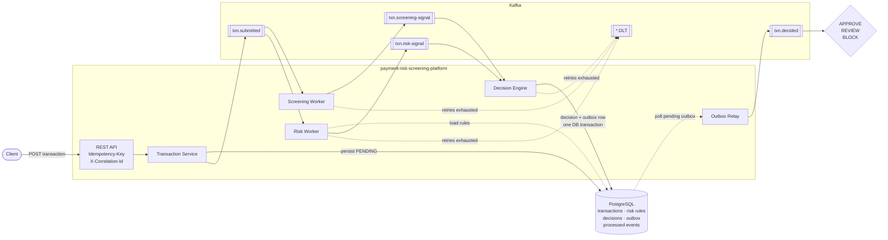

# payment-risk-screening-platform

A Spring Boot service for screening payment transactions before they are accepted. The target design sends
each submitted payment through two independent checks in parallel: a **screening** check of the payer and
payee names against a watchlist, and a **risk** score built from configurable rules (amount, payer velocity,
country risk, cross-border). A decision engine will then combine both results into **APPROVE**, **REVIEW**
(held for a human reviewer) or **BLOCK**, and publish that decision for downstream systems. The service is
meant to make this decision reliably and auditably: no transaction decided twice, no decision lost, rules
changed through data migrations rather than code changes, and every event traceable back to the HTTP request
that caused it.

The service is being built in phases. **Today** it has the build and runtime skeleton, the complete database
schema and data-access layer, and JWT authentication. The transaction pipeline itself (API, workers,
decision engine, outbox relay) is **planned**. See [Implementation status](#implementation-status).

## Contents

- [Architecture](#architecture)
- [Implementation status](#implementation-status)
- [Tech stack](#tech-stack)
- [Getting started](#getting-started)
- [Data model](#data-model)
- [API reference](#api-reference)
- [Testing](#testing)
- [Design decisions](#design-decisions)
- [Limitations](#limitations)

## Architecture

The diagram shows the **target design**. The parts marked Planned in the status table are not built yet.
A sequence diagram of the same flow is in [docs/ARCHITECTURE.md](docs/ARCHITECTURE.md).



Planned flow:

1. A merchant submits a transaction over REST with an `Idempotency-Key` header.
2. The transaction service will store it as `PENDING` and publish `txn.submitted`.
3. The screening worker and the risk worker will each consume `txn.submitted` in their own consumer group, in
   parallel, and each publish one signal.
4. The decision engine will wait for both signals, decide, and write the decision and an outbox row in one
   database transaction.
5. An outbox relay will publish the decision to `txn.decided`.
6. Events that still fail after retries with exponential backoff will go to the matching dead-letter topic.

### Topics

All eight topics are declared in `config/KafkaTopicConfig` and created when the application starts. No
producers or consumers use them yet.

| Topic | Planned producer | Planned consumers | Record key |
|-------|------------------|-------------------|------------|
| `txn.submitted` | Transaction service | Screening worker, risk worker | transaction id |
| `txn.screening-signal` | Screening worker | Decision engine | transaction id |
| `txn.risk-signal` | Risk worker | Decision engine | transaction id |
| `txn.decided` | Outbox relay | Downstream systems | transaction id |
| `txn.submitted.DLT`, `txn.screening-signal.DLT`, `txn.risk-signal.DLT`, `txn.decided.DLT` | Dead-letter publishing for the topic above | Operators | original key |

Every event for one transaction uses the transaction id as its key, so all of them land on the same partition.

### Why event-driven instead of a synchronous API

Screening and risk scoring are independent checks. They depend on different data, can be slow, and can
fail for different reasons. In a synchronous design, the API call would have to wait for both, would fail
when either failed, and would couple the merchant's request latency to the slowest check. In the planned
event-driven design:
- The API will only need to store the transaction and hand it off to Kafka.
- The two workers will run and scale separately.
- A failing check can be retried or dead-lettered without losing the transaction.
- The decision will be recorded durably and published through the outbox.

The cost is that the outcome is asynchronous, and every consumer has to handle duplicate events. The design
handles that explicitly with processed-event tracking and idempotency keys, whose tables and queries already
exist.

## Implementation status

| Phase | Scope | Status |
|-------|-------|--------|
| 0 | Skeleton: Maven build, package layout, profile configuration, Dockerfile, docker-compose, actuator health and Prometheus | Done |
| 1 | Persistence: Flyway schema and seed data, JPA entities, repositories, outbox claim queries, repository tests | Done |
| 2 | Authentication: JWT login, MERCHANT and REVIEWER roles, RFC 7807 401/403 responses | Done |
| 3 | Transaction API: submit and fetch transactions, `Idempotency-Key` handling, correlation id propagation, problem-detail error mapping, publishing `txn.submitted` | Planned |
| 4 | Screening worker: watchlist screening, `txn.screening-signal`, consumer idempotency, retry with backoff and dead-letter topics | Planned |
| 5 | Risk worker: rule evaluation from `risk_rules`, `txn.risk-signal` | Planned |
| 6 | Decision engine and outbox relay: combining signals, decisions, publishing `txn.decided` | Planned |
| 7 | Review workflow: REVIEWER endpoints for the manual review queue | Planned |
| 8 | Operational hardening: application metrics, tracing, dead-letter inspection, CI | Planned |

## Tech stack

Versions below are the ones the build resolves: the Spring Boot parent and explicit pins come from
`pom.xml`, and everything else is managed by the Spring Boot 3.3.13 BOM.

| Area | Technology | Version |
|------|------------|---------|
| Language | Java | 21 |
| Framework | Spring Boot | 3.3.13 |
| | Spring Framework | 6.1.21 |
| Security | Spring Security (OAuth2 resource server) | 6.3.10 |
| | Nimbus JOSE + JWT | 9.37.3 |
| Persistence | Hibernate ORM (Spring Data JPA) | 6.5.3.Final |
| | Flyway (with `flyway-database-postgresql`) | 10.10.0 |
| | PostgreSQL JDBC driver | 42.7.7 |
| Messaging | Spring for Apache Kafka | 3.2.10 |
| | Apache Kafka clients | 3.7.2 |
| Cache client | Lettuce (Spring Data Redis) | 6.3.2.RELEASE |
| Observability | Micrometer with Prometheus registry | 1.13.15 |
| Code generation | Lombok | 1.18.38 |
| Build | Maven (via `./mvnw`) | 3.9.9 |
| Tests | JUnit Jupiter | 5.10.5 |
| | Testcontainers (pinned in `pom.xml`) | 1.21.4 |
| | testcontainers-redis (pinned in `pom.xml`) | 2.2.2 |
| | Awaitility | 4.2.2 |

Container images: `postgres:16-alpine`, `redis:7-alpine`, `apache/kafka:3.8.0` (docker-compose),
`confluentinc/cp-kafka:7.7.1` (tests), and `maven:3.9-eclipse-temurin-21` / `eclipse-temurin:21-jre-alpine`
(Dockerfile build and runtime stages).

Redis is connected and reported in the health endpoint, but no application code uses it yet.

## Getting started

### Prerequisites

- **Docker** with Compose v2 and BuildKit (`docker buildx`). The Dockerfile uses BuildKit cache mounts.
- **JDK 21**, only to run the app outside Docker or to run the tests. No separate Maven install is needed
  because the repository includes the Maven wrapper.
- `openssl` or any other way to generate a random secret.
- `jq` (optional), used in the curl examples below to extract the token.

### Run everything with docker compose

```bash
git clone https://github.com/RITIKA-SHARMAA/payment-risk-screening-platform.git
cd payment-risk-screening-platform

cp .env.example .env
# Set JWT_SECRET in .env to a random value of at least 32 bytes, for example:
#   JWT_SECRET=<output of: openssl rand -base64 48>

docker compose up --build
```

This starts PostgreSQL, Redis, Kafka (single-node KRaft, no ZooKeeper) and the application with the `local`
profile. Flyway applies all migrations on startup. Check that it is up:

```bash
curl http://localhost:8080/actuator/health
```

`JWT_SECRET` has no default. docker-compose refuses to run **any** command, including `logs`, `exec` and
`down`, until it is set. Keeping it in `.env`, which compose reads automatically and git ignores, avoids
setting it in every shell.

### Ports

| Service | Host port | Override |
|---------|-----------|----------|
| Application | 8080 | `APP_HOST_PORT` |
| PostgreSQL | **5433** | `POSTGRES_HOST_PORT` |
| Redis | 6379 | `REDIS_HOST_PORT` |
| Kafka (external listener) | 9094 | `KAFKA_HOST_PORT` |

PostgreSQL is published on host port **5433**, not 5432, so it doesn't clash with a PostgreSQL already running
locally. To use another port, set it in `.env` (for example `POSTGRES_HOST_PORT=15432`). If you run the app
on the host, also set `DB_URL=jdbc:postgresql://localhost:15432/risk`. Inside the compose network, services
talk to each other on their standard ports (`postgres:5432`, `kafka:9092`, `redis:6379`).

### Dev-only credentials

These values exist only for local development and are not secrets:

- **Database password** `risk_local_only` (user `risk`, database `risk`). It is the default in
  `docker-compose.yml` and in the `local` Spring profile. Override it with `POSTGRES_PASSWORD` for compose and
  `DB_PASSWORD` for the application.
- **Demo API users**, seeded by `src/main/resources/db/seed-dev/V8_1__seed_dev_users.sql`:

  | Username | Password | Role | Merchant |
  |----------|----------|------|----------|
  | `merchant.demo` | `merchant-dev-password` | MERCHANT | `merchant-demo` |
  | `reviewer.demo` | `reviewer-dev-password` | REVIEWER | none |

  Only the `local` and `test` profiles add the `db/seed-dev` Flyway location. The packaged jar and Docker
  image have **no default profile**, so these users are never created unless `local` or `test` is
  activated explicitly.

### Run the application on the host

```bash
docker compose up -d postgres redis kafka
set -a; source .env; set +a          # exports JWT_SECRET into this shell
./mvnw spring-boot:run               # the Maven plugin activates the "local" profile
```

### Environment variables

Application (`src/main/resources/application.yml`):

| Variable | Required | Default | Purpose |
|----------|----------|---------|---------|
| `JWT_SECRET` | **Yes** | none, in every profile | HMAC-SHA256 key for signing and verifying access tokens, at least 32 bytes. Startup fails without it. |
| `SPRING_PROFILES_ACTIVE` | No | none | `local` enables dev defaults and demo users; compose sets it to `local`. |
| `DB_URL` | Yes, outside `local` | `jdbc:postgresql://localhost:5433/risk` in `local` | JDBC URL |
| `DB_USERNAME` | Yes, outside `local` | `risk` in `local` | Database user |
| `DB_PASSWORD` | Yes, outside `local` | `risk_local_only` in `local` | Database password |
| `DB_POOL_MAX_SIZE` | No | `10` | Hikari maximum pool size |
| `REDIS_HOST` | Yes, outside `local` | `localhost` in `local` | Redis host |
| `REDIS_PORT` | No | `6379` | Redis port |
| `REDIS_PASSWORD` | No | empty | Redis password |
| `KAFKA_BOOTSTRAP_SERVERS` | Yes, outside `local` | `localhost:9094` in `local` | Kafka bootstrap servers |
| `KAFKA_CONSUMER_GROUP` | No | `payment-risk-screening` | Default consumer group id |
| `KAFKA_TOPIC_PARTITIONS` | No | `3` | Partitions for the declared topics |
| `KAFKA_TOPIC_REPLICAS` | No | `1` | Replication factor for the declared topics |
| `JWT_ISSUER` | No | `payment-risk-screening-platform` | `iss` claim written and required |
| `JWT_ACCESS_TOKEN_TTL` | No | `PT15M` | Access token lifetime (ISO-8601 duration) |
| `FLYWAY_ENABLED` | No | `true` | Run migrations on startup |
| `FLYWAY_LOCATIONS` | No | `classpath:db/migration` (plus `classpath:db/seed-dev` in `local`) | Migration locations |
| `SERVER_PORT` | No | `8080` | HTTP port |
| `MANAGEMENT_ENDPOINTS` | No | `health,info,prometheus` | Actuator endpoints exposed over HTTP |
| `MANAGEMENT_HEALTH_SHOW_DETAILS` | No | `never` (`always` in `local`) | Health component details |
| `LOG_LEVEL_APP` | No | `INFO` (`DEBUG` in `local`) | Log level for `com.ritikasharma.risk` |

docker-compose only (`docker-compose.yml`, usually set in `.env`):

| Variable | Default | Purpose |
|----------|---------|---------|
| `POSTGRES_DB` / `POSTGRES_USER` / `POSTGRES_PASSWORD` | `risk` / `risk` / `risk_local_only` | Database created by the Postgres container and passed to the app |
| `POSTGRES_HOST_PORT`, `REDIS_HOST_PORT`, `KAFKA_HOST_PORT`, `APP_HOST_PORT` | `5433`, `6379`, `9094`, `8080` | Host port mappings |
| `KAFKA_CLUSTER_ID` | fixed dev value | KRaft cluster id |
| `JAVA_OPTS` | `-XX:MaxRAMPercentage=75` | JVM options for the app container |

## Data model

The schema is managed only by Flyway (`src/main/resources/db/migration`). Hibernate validates it and never
changes it. Every table has `created_at` and `updated_at` (`TIMESTAMPTZ`). Status-like columns are
`VARCHAR` with a `CHECK` constraint listing the allowed values, and a test fails if a Java enum and its
constraint drift apart.

### Transaction pipeline tables

| Table | What it is for |
|-------|----------------|
| `transactions` | Submitted payments: merchant, amount and currency, payer and payee names and countries, payer account, status (`PENDING`, `APPROVED`, `IN_REVIEW`, `BLOCKED`, `FAILED`), correlation id. Indexed for merchant lookups and for counting a payer's recent transactions. |
| `idempotency_records` | One row per `Idempotency-Key` per merchant (unique on `(idempotency_key, merchant_id)`). Stores a hash of the request and the response to replay for a repeated request. Has an expiry for cleanup. |
| `screening_signals` | Result of watchlist screening for a transaction: hit or not, match score, matched entry. At most one per transaction. |
| `risk_signals` | Risk score for a transaction and the rules that fired (JSON). At most one per transaction. |
| `decisions` | The final APPROVE / REVIEW / BLOCK for a transaction, with score, screening hit and reasons. At most one per transaction; indexed by outcome and time for a review queue. |
| `risk_rules` | Rule configuration: type, which worker evaluates it, weight, threshold, JSON parameters, enabled flag, and the decision cut-offs. |
| `watchlist_entries` | Names to screen against, with a normalized form used for matching. |
| `country_risk` | Risk level (`LOW`, `MEDIUM`, `HIGH`, `PROHIBITED`) and score (0–100) per ISO country code. |
| `outbox_events` | Events waiting to be published to Kafka, with the claim columns described below. |
| `processed_events` | Which consumer group has already processed which event id (unique on `(consumer_group, event_id)`). |

Authentication adds `app_users` (username, BCrypt password hash, optional merchant id, enabled flag) and
`user_roles` (MERCHANT or REVIEWER per user).

Seed migrations load reference data: 24 country risk rows, 13 synthetic watchlist entries, and 13 risk rules,
including two decision cut-offs (REVIEW at a score of 40, BLOCK at 75) and one rule that ships disabled.

### Outbox claim protocol

Several relay instances may poll the same outbox table, so a plain "published" flag isn't enough: two
instances could read the same unpublished row and both send it. Instead, a relay **claims** rows.
`OutboxEventRepository` implements the protocol and tests cover it; the relay that will call it is planned
for phase 6.

1. **Claim.** In one short transaction, a single statement selects up to N rows that are `PENDING` and due
   (`next_attempt_at <= now`), or `CLAIMED` longer ago than a timeout (a crashed relay). It locks them with
   `SELECT ... FOR UPDATE SKIP LOCKED` and sets `status = 'CLAIMED'`, `claimed_by`, `claimed_at` and
   `attempts = attempts + 1`, returning the claimed rows. `SKIP LOCKED` makes a concurrent relay skip rows
   another relay has locked instead of waiting for them, so two relays never claim the same row. A test
   runs two relays at once and checks their batches don't overlap.
2. **Publish** to Kafka, outside any database transaction.
3. **Report** with one of three updates, each allowed only while `status = 'CLAIMED'` and `claimed_by` is
   still this relay:
   - `markPublished` sets `PUBLISHED` and `published_at`.
   - `markForRetry` returns the row to `PENDING` with a later `next_attempt_at` and clears the claim.
   - `markFailed` sets `FAILED`.

   If another relay has since taken over a stale claim, the update affects no rows and the old relay stops.

**Delivery is at-least-once.** A relay can crash after Kafka accepted the event but before `markPublished`.
Its claim then goes stale and another relay publishes the event again. Consumers of `txn.decided` **must
deduplicate by event id**, which is the outbox row id. Consumers inside this service will do the same with
`processed_events`: `ProcessedEventRepository.markProcessed` inserts with `ON CONFLICT DO NOTHING` and
returns 0 for an event id the consumer group has already seen.

## API reference

### Authentication

Tokens are HS256-signed JWTs. Send them as `Authorization: Bearer <token>`. They expire after
`JWT_ACCESS_TOKEN_TTL` (15 minutes by default). There are no refresh tokens: log in again after expiry.

#### `POST /api/v1/auth/login`

Public. Exchanges a username and password for an access token. Usernames are case-insensitive.

```bash
curl -s -X POST http://localhost:8080/api/v1/auth/login \
  -H 'Content-Type: application/json' \
  -d '{"username":"merchant.demo","password":"merchant-dev-password"}'
```

`200 OK`, sent with `Cache-Control: no-store`:

```json
{
  "accessToken": "eyJhbGciOiJIUzI1NiJ9...",
  "tokenType": "Bearer",
  "expiresIn": 900,
  "expiresAt": "2026-01-01T12:15:00Z",
  "roles": ["MERCHANT"]
}
```

Token claims: `sub` (username), `iss`, `iat`, `exp`, `jti`, `roles`, and `merchant_id` for merchant users.

Errors:
- `400` when username or password is blank.
- `401` for an unknown user or a wrong password. Both cases return exactly the same body.

#### `GET /api/v1/auth/me`

Requires any valid token. Returns the caller's identity as read from the token.

```bash
TOKEN=$(curl -s -X POST http://localhost:8080/api/v1/auth/login \
  -H 'Content-Type: application/json' \
  -d '{"username":"merchant.demo","password":"merchant-dev-password"}' | jq -r .accessToken)

curl -s http://localhost:8080/api/v1/auth/me -H "Authorization: Bearer $TOKEN"
```

```json
{"username":"merchant.demo","roles":["MERCHANT"],"merchantId":"merchant-demo","tokenExpiresAt":"2026-01-01T12:15:00Z"}
```

### Error format

Errors use RFC 7807 problem details with `Content-Type: application/problem+json`:

```json
{"type":"about:blank","title":"Unauthorized","status":401,"detail":"Authentication is required to access this resource.","instance":"/api/v1/auth/me"}
```

| Status | When | `detail` |
|--------|------|----------|
| 401 | No token on a protected route | `Authentication is required to access this resource.` |
| 401 | Malformed, expired, wrongly signed or wrong-issuer token | `The bearer token is malformed, expired or has an invalid signature.` |
| 401 | Failed login | `Invalid username or password.` |
| 403 | Valid token without the required role | `You do not have permission to access this resource.` |

Token-related 401 and 403 responses also carry the RFC 6750 `WWW-Authenticate: Bearer ...` header.

### Access rules

| Route | Access |
|-------|--------|
| `POST /api/v1/auth/login` | Public |
| `GET /actuator/health`, `GET /actuator/prometheus` | Public |
| `/api/v1/transactions/**` | MERCHANT role (reserved for phase 3; no endpoints yet) |
| `/api/v1/reviews/**` | REVIEWER role (reserved for phase 7; no endpoints yet) |
| Everything else | Any valid token |

Transaction endpoints arrive in phase 3 and review endpoints in phase 7. Neither exists yet.

## Testing

```bash
./mvnw verify
```

Tests need a running Docker daemon, because Testcontainers starts **real PostgreSQL, Kafka and Redis
containers**. Nothing is replaced by an in-memory database or a mocked broker.

- **Repository tests** (`@RepositoryTest`) run `@DataJpaTest` against a PostgreSQL container with every Flyway
  migration and the dev seed applied. They cover:
  - unique and check constraints
  - seed data
  - every custom query
  - a concurrent two-relay outbox claim
- **Integration tests** (`@IntegrationTest`) start the whole application against PostgreSQL, Kafka and Redis
  containers and use MockMvc. They cover:
  - health and Prometheus endpoints
  - login success, wrong password and unknown user
  - expired, malformed, foreign-key and foreign-issuer tokens
  - a missing token, and a MERCHANT token on a REVIEWER route
- A random JWT secret is generated for each test context (`src/test/resources/application-test.yml`).

With Colima instead of Docker Desktop, export:

```bash
export DOCKER_HOST=unix://$HOME/.colima/default/docker.sock
export TESTCONTAINERS_DOCKER_SOCKET_OVERRIDE=/var/run/docker.sock
```

**Testcontainers is pinned to 1.21.4.** Spring Boot 3.3 manages Testcontainers 1.19.8, whose Docker client
uses Docker API version 1.32. Docker Engine 29 and later reject API versions that old, so with 1.19.8 no
container can start. The pin in `pom.xml` overrides the managed version.

**Kafka images differ between tests and docker-compose; both run in KRaft mode.**
- Tests use `confluentinc/cp-kafka:7.7.1` through `org.testcontainers.containers.KafkaContainer`. Spring Boot
  3.3's `@ServiceConnection` wires connection details automatically only for that container class and doesn't
  recognise the `apache/kafka` container class.
- docker-compose uses the official `apache/kafka:3.8.0` image.

## Design decisions

**No JPA relationships.** Entities refer to each other by id columns (for example
`screening_signals.transaction_id`), backed by foreign keys in the database, rather than with `@ManyToOne` or
`@OneToMany`. The planned workers and decision engine will each load exactly the rows they need, in short
transactions driven by events. Object graphs would add lazy-loading surprises, accidental cascades and
N+1 queries without helping that access pattern. Because there are no associations, entities can safely use
a minimal Lombok subset (`@Getter` and a protected no-args constructor) without generated `equals`,
`hashCode` or `toString` walking relationships. The one collection mapping, a user's set of role values, is
written without Lombok.

**Risk rules live in the database.** Weights, thresholds, rule parameters, enablement and decision cut-offs
are rows in `risk_rules`, changed through Flyway migrations. Tuning a threshold or disabling a rule is then a
reviewed, versioned data change rather than a Java change. Migrations run at application startup, so the change
takes effect when the new migration is deployed. The whole rule set can also be inspected with SQL. Java code
will contain only the evaluation strategy for each rule type, never the numbers.

**The idempotency column is `idempotency_key`, not `key`.** `KEY` is a keyword in SQL and in several
databases and tools. A column with that name needs quoting in some contexts and invites subtle bugs in
native queries. `idempotency_key` also reads unambiguously next to `merchant_id` in the unique constraint
`(idempotency_key, merchant_id)`.

**Decision cut-offs sit in `risk_rules`.** The score at which a transaction goes to REVIEW or BLOCK is as much
a tunable risk parameter as a rule weight, so it belongs with the rules and changes the same way. Cut-offs are
rows with `rule_type = 'DECISION_CUTOFF'`, a `decision` and a `threshold`. A check constraint enforces their
shape: a cut-off must have an outcome and a threshold and no worker signal type, and every other rule must
have a signal type and no outcome. A separate table would duplicate the enablement, auditing and migration
handling that `risk_rules` already has.

## Limitations

- **Seed data is invented.** The watchlist names are fictional and the country risk levels and scores are
  illustrative. Neither is compliance data, and neither should be used to screen real payments.
- **Amount rules are per currency, with no FX conversion.** A rule with `"currency": "USD"` applies only to
  USD transactions. Other currencies are unaffected unless they have their own rows.
- **Delivery is at-least-once.** Outbox publishing can repeat an event after a relay failure, so every consumer
  has to deduplicate by event id.
- **Single-node local setup.** docker-compose runs one Kafka broker (replication factor 1), one PostgreSQL
  and one Redis, with no high availability. It is for development only.
- **Most of the pipeline isn't built yet.** Phases 3–8 are planned: there is no transaction API, worker,
  decision engine, outbox relay or review endpoint.
- **Authentication is minimal.** HS256 uses one shared secret. There are no refresh tokens, no token
  revocation, and no user management API; users are added through migrations.
