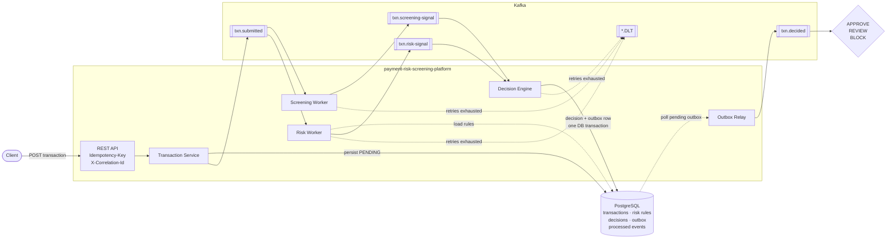
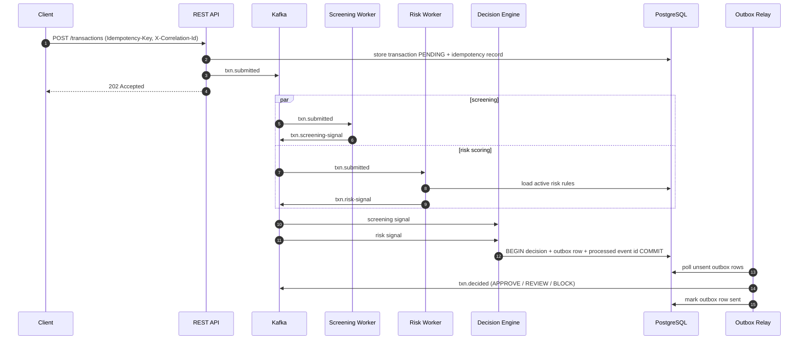

# Architecture

Event-driven payment risk screening. A submitted transaction is screened and risk-scored in parallel;
a decision engine combines both signals into **APPROVE**, **REVIEW** or **BLOCK**.

## Flow

## Components

| Component | Consumes | Produces | Notes |
|-----------|----------|----------|-------|
| REST API | HTTP | — | Requires `Idempotency-Key`; propagates `X-Correlation-Id`; RFC 7807 errors |
| Transaction Service | — | `txn.submitted` | Persists the transaction before publishing |
| Screening Worker | `txn.submitted` | `txn.screening-signal` | Own consumer group |
| Risk Worker | `txn.submitted` | `txn.risk-signal` | Rules, thresholds and weights come from the DB |
| Decision Engine | both signal topics | outbox row | Decides only when both signals are present |
| Outbox Relay | outbox table | `txn.decided` | At-least-once publish; consumers dedupe by event id |

## Reliability guarantees

- **Request idempotency.** `Idempotency-Key` replay returns the original response.
- **Consumer idempotency.** Processed event ids are recorded in the same transaction as side effects.
- **Transactional outbox.** `txn.decided` is never lost or published for a rolled-back decision.
- **Retry → DLT.** Exponential backoff, then `<topic>.DLT`. Non-retryable errors skip retries.
- **Traceability.** The correlation id flows HTTP → MDC → Kafka headers → consumer MDC → outbox → `txn.decided`.

## Decision sequence

